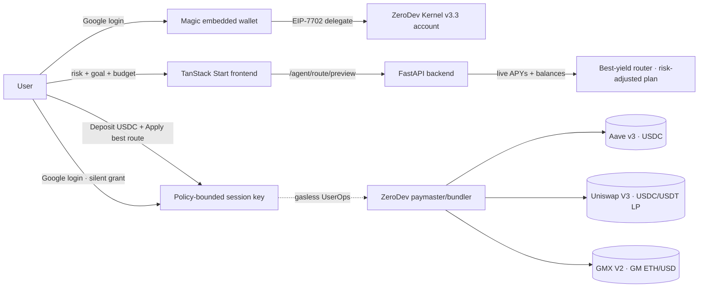

# AXIS — AI DeFi Portfolio Agent

> **Set. Forget. Earn.** Sign in with Google, deposit USDC, tap once — AXIS invests and rebalances on **Arbitrum One** for you, hands-free, with no seed phrase, no gas, and **no wallet pop-ups after Google login**.

AXIS turns "I want my money to earn safely" into a real, on-chain, non-custodial position. The user never sees a private key, never signs a transaction after Google login, and never gives AXIS the ability to move funds anywhere except their own account.

- **Live app:** https://axis-mainnet.vercel.app
- **Live API:** https://axis-api-beta.vercel.app (`/health`, `/config/status`)
- **Chain:** Arbitrum One (`42161`)
- **Architecture deep-dive + diagrams:** [`docs/ARCHITECTURE.md`](docs/ARCHITECTURE.md)
- **Production truth / audit checklist:** [`docs/PRODUCTION_AUDIT.md`](docs/PRODUCTION_AUDIT.md)
- **Living project memory:** [`docs/AXIS_MEMORY.md`](docs/AXIS_MEMORY.md)
- **Hackathon submission pack:** [`docs/SUBMISSION.md`](docs/SUBMISSION.md) · [`docs/PITCH_DECK.md`](docs/PITCH_DECK.md) · [`docs/DEMO_SCRIPT.md`](docs/DEMO_SCRIPT.md) · [`docs/STARTUP_STRATEGY.md`](docs/STARTUP_STRATEGY.md)

---

## Table of contents

1. [What AXIS does](#what-axis-does)
2. [Why it's safe (security model)](#why-its-safe-security-model)
3. [How it works end-to-end](#how-it-works-end-to-end)
4. [Tech stack](#tech-stack)
5. [Repository layout](#repository-layout)
6. [Strategy engine (no AI guesswork)](#strategy-engine-no-ai-guesswork)
7. [Hands-off mode (gasless session keys)](#hands-off-mode-gasless-session-keys)
8. [API reference](#api-reference)
9. [Local development](#local-development)
10. [Environment variables](#environment-variables)
11. [Deployment](#deployment)
12. [Testing](#testing)
13. [Production readiness & known gaps](#production-readiness--known-gaps)

---

## What AXIS does

- **Google sign-in → embedded wallet.** [Magic](https://magic.link) creates a non-custodial EOA from a Google login. No seed phrase, no extension.
- **Pick a risk level + goal.** Conservative / Moderate / Aggressive × Protect / Grow / Maximize. A deterministic 3×3 matrix produces a real allocation across Aave v3 stablecoin markets (USDC/USDT). Live APYs come from on-chain / Aave data, not hardcoded numbers.
- **Deposit USDC, tap "Begin".** AXIS supplies to Aave on Arbitrum. Every action is a real, verifiable Arbiscan transaction.
- **Best-yield router + one-tap apply.** AXIS scans live APYs across every venue (Aave USDC/USDT, the Uniswap V3 USDC/USDT stable LP, and the GMX V2 GM pool) and builds **one** risk-adjusted allocation. **"Apply best route"** executes the whole plan in a single tap — each venue as its own gasless UserOp, **no signing** — and skips any leg it can't fund, then shows a "what AXIS did" summary.
- **Balance-aware.** The router reads what the account actually holds (USDC / USDT / ETH). GMX needs a little of the user's own ETH for its keeper fee, so if that's missing AXIS pre-skips GMX and folds the money into the stable core instead of failing.
- **Hands-off from login.** At Google sign-in, AXIS silently grants a **policy-bounded session key** (Magic headless approval — no “okay in wallet” step in the product UX). Every venue action (Aave supply/withdraw, LP open/close, GMX add/close) runs gaslessly with zero further prompts, and funds can only ever move to the user's own account.
- **Power users** can define a custom USDC/USDT split *and* toggle individual market venues (e.g. turn GMX off) for the auto-route — always inside the same safety envelope.
- **Plain-English reporting.** An AI layer (Venice primary, OpenAI fallback) *explains* what the deterministic engine did — it never decides allocations.

## Why it's safe (security model)

The core guarantee: **even if AXIS's agent key is fully compromised, no attacker can steal user funds.**

This is enforced **on-chain**, not by trust. At login, AXIS enables a ZeroDev [Kernel v3.3](https://docs.zerodev.app) **session key** bounded by a `CallPolicy` (`src/lib/kernel-session.ts`) — silently as part of account setup. The **base policy** (always on) permits only:

| Allowed call | Hard constraints baked into the signed policy |
|---|---|
| `USDC.approve(spender, amount)` | `spender` **must equal** the Aave Pool |
| `AavePool.supply(asset, amount, onBehalfOf, ref)` | `asset` **must equal** USDC · `onBehalfOf` **must equal** the owner |
| `AavePool.withdraw(asset, amount, to)` | `asset` **must equal** USDC · `to` **must equal** the owner |

Aggressive users who give a **one-time market-risk consent** unlock two extra venues, still fully pinned:

| Extra allowed calls (market-risk) | Hard constraints |
|---|---|
| Uniswap V3: `approve` → SwapRouter/NPM, `exactInputSingle`, `mint`, `decreaseLiquidity`/`collect`/`burn` | USDC/USDT only · **recipient = owner** on swap + mint · full-range USDC/USDT stable pair |
| GMX V2: `approve` → Router, `sendWnt`, `sendTokens`, `createDeposit`/`createWithdrawal` | **receiver = owner** and **market = the vetted GM pool** pinned at fixed calldata offsets · `sendWnt` value capped (~0.01 ETH) so a leaked key can't drain ETH |

Plus a **rate-limit policy** (max 100 ops/day). Any other call — a transfer, a different token, a different recipient — is rejected by the smart account itself. Withdrawals/positions can *only* settle back to the owner. Funds are structurally trapped inside the user's own account, on every venue.

Additional layers:

- **Cryptographic auth on every mutating route** — Magic DID tokens are verified server-side with `magic-admin` (`backend/services/auth_service.py`). No token → `401`.
- **Tenant isolation** — `assert_same_user` (authenticated issuer must equal the target `user_id`) and `assert_wallet_belongs_to_user` (a wallet can't be operated by a different account) guard every route (`backend/services/tenant_guard.py`). Wallet addresses can't be claimed by two users.
- **Anti-replay server executor** — the Node executor (`src/lib/agent-executor.ts`) never trusts a client-supplied approval blob. It re-verifies the caller's Magic token and loads *their* stored approval server-side before submitting a UserOp.
- **On-chain verification** — activation/rebalance confirmations require a real transaction receipt with `status == 1` (`verify_tx_success`). Simulated/random hashes are rejected.
- **Rate limiting** (slowapi) per route; **CORS** scoped to AXIS origins; **secrets** live only in Vercel encrypted env, never in git.

See [`docs/ARCHITECTURE.md`](docs/ARCHITECTURE.md) for the full threat model and sequence diagrams.

## How it works end-to-end



## Tech stack

| Layer | Choice |
|---|---|
| Frontend | TanStack Start (React 19, Vite, Nitro SSR) + Tailwind + Radix UI |
| Server functions | TanStack `createServerFn` (Node) — hosts the ZeroDev session executor |
| Backend | FastAPI (Python 3.12) + SQLAlchemy (async) |
| Auth / wallet | Magic Labs (Google OAuth + embedded EOA) |
| Smart accounts | ZeroDev Kernel v3.3, EIP-7702, session keys + `CallPolicy` |
| Gas | ZeroDev v3 bundler + paymaster (sponsored / gasless) |
| DeFi | Aave v3 (USDC/USDT supply), Uniswap V3 USDC/USDT stable LP, GMX V2 GM ETH/USD pool — all on Arbitrum One |
| Persistence | PostgreSQL (Supabase, async SQLAlchemy + asyncpg) |
| AI | Venice (primary) + OpenAI (fallback) — explanation only |
| Web intelligence | TinyFish + x402 micropayments |
| Chain access | Alchemy dedicated Arbitrum One RPC |
| Hosting | Vercel (`axis-mainnet` frontend, `axis-api` backend) |

## Repository layout

```
axis/
├── src/                        # TanStack Start frontend
│   ├── lib/
│   │   ├── wallet.ts           # Magic + EIP-7702 Kernel delegation, deploy/rebalance
│   │   ├── kernel-session.ts   # Builds the policy-bounded session approval (granted at login)
│   │   ├── agent-executor.ts   # Server fn: gasless UserOp executor (holds agent key)
│   │   ├── strategy.ts         # Custom-strategy types
│   │   ├── api.ts              # Typed backend client
│   │   └── chain.ts            # Arbitrum chain config helpers
│   ├── hooks/useAxis.ts        # React Query hooks
│   └── routes/                 # Pages (onboard, dashboard, merch, ...)
├── backend/                    # FastAPI backend
│   ├── main.py                 # App, CORS, rate limiting, startup validation
│   ├── config.py               # Env settings + required-key validation
│   ├── chain_config.py         # Per-chain addresses (USDC/USDT/Aave), APY math
│   ├── dependencies.py         # require_auth / require_own_user
│   ├── routes/                 # auth, agent, portfolio, health
│   └── services/
│       ├── auth_service.py     # Magic DID verification
│       ├── tenant_guard.py     # Per-user isolation
│       ├── strategy_engine.py  # Deterministic 3x3 matrix + custom validation
│       ├── yield_router.py     # Best-yield router (scan venues → one plan)
│       ├── aave_transactions.py# Aave calldata, USDC/USDT/ETH balances, tx checks
│       ├── uniswap_lp.py       # USDC/USDT stable LP enter/exit calldata
│       ├── gmx_gm.py           # GMX V2 GM deposit/withdraw session calls
│       ├── portfolio_tracker.py# Persistence (Postgres)
│       └── ...                 # ai_agent, x402_client, yield_fetcher, eip7702_sponsor
└── docs/                       # ARCHITECTURE, PRODUCTION_AUDIT, memory, keys
```

## Strategy engine (no AI guesswork)

Allocations are **deterministic**, defined in `backend/services/strategy_engine.py`. The AI layer only translates a finished plan into plain English — it can never invent an allocation.

`(risk, goal) → (cash buffer %, USDC weight, USDT weight)`:

| | Protect | Grow | Maximize |
|---|---|---|---|
| **Conservative** | 10% cash · 100% USDC | 5% cash · 85/15 | 0% cash · 70/30 |
| **Moderate** | 5% cash · 90/10 | 0% cash · 60/40 | 0% cash · 40/60 |
| **Aggressive** | 0% cash · 70/30 | 0% cash · 40/60 | 0% cash · 20/80 |

- Minimum budget **$10 USDC**; maximum **$100,000**.
- Aggressive × Maximize tilts toward the higher **live** Aave APY between USDC/USDT.
- Dust legs (< $0.50) fold into the largest leg so tiny deposits still produce one clean position.
- Custom strategies are validated (`validate_custom_legs`): only `aave`, only USDC/USDT, ≤ 4 legs, weights must sum to 100%.

### Best-yield router (`backend/services/yield_router.py`)

On top of the matrix, AXIS runs a **deterministic best-yield router**. It fetches live APYs across Aave USDC/USDT, the Uniswap V3 USDC/USDT stable LP, and the GMX V2 GM ETH/USD pool concurrently, then builds **one** risk-adjusted `RoutePlan`:

- **Stable core → Aave USDC**, the only gasless-supply path (Aave USDT APY is shown for comparison but never allocated, since USDT-supply isn't in the session policy).
- **Market sleeve (Uniswap LP + GMX)** only for **Aggressive + market-risk consent**; GMX exposure is sub-capped. Below-minimum sleeves **fold back** into the stable core so even a **$10** deposit fully deploys and nothing dust-fails on-chain.
- **Balance-aware:** reads real USDC/USDT/ETH. If the account lacks the ETH GMX needs for its keeper fee, GMX is **pre-skipped** (its share folds into the core), surfaced with an "add ETH to include it" hint.
- **Power-user toggles:** `exclude_venues` lets a user turn GMX/LP off; excluded venues fold back to the stable core.
- **One-tap apply:** `POST /agent/route/apply/prepare` returns the session calls grouped per venue; the frontend runs each as its own gasless UserOp with **graceful skip**, then `POST /agent/route/apply/confirm` verifies on-chain and logs only what executed.

## Hands-off mode (gasless session keys)

1. At Google login (and silently again from the dashboard if needed), the frontend fetches the agent's session-signer address (`getSessionSignerAddress` server fn).
2. `buildSessionApproval` builds a `CallPolicy`-bounded Kernel account and completes Magic's headless session grant — **no user-facing wallet popup** in the product UX. Aggressive users can include market-risk venues (LP + GMX) in the same approval when they consent.
3. The serialized approval is stored server-side via `POST /api/agent/session/enable`.
4. To act, the backend builds **policy-safe, owner-pinned** calls (`build_rebalance_calls`, `build_supply_calls`, `build_lp_enter_calls`/`exit`, `build_gm_deposit_calls`/`withdraw`); the Node executor loads the owner's approval (after re-verifying their token) and submits **gasless** UserOps through the ZeroDev paymaster. GMX's native ETH keeper fee is the one cost drawn from the user's own ETH (never sponsored).
5. Result is verified on-chain and logged.

## API reference

Base URL: `https://axis-api-beta.vercel.app`. Mutating routes require `Authorization: Bearer <magic_did_token>`.

| Method | Path | Auth | Purpose |
|---|---|---|---|
| `GET` | `/health` | – | Service + config health |
| `GET` | `/config/status` | – | Public-safe config checklist (RPC key **redacted**) |
| `POST` | `/api/auth/verify` | – | Verify a Magic DID token |
| `POST` | `/api/auth/register` | token | Register/bind user + wallet |
| `POST` | `/api/auth/sponsor-eip7702` | token | Sponsor the Type-4 delegation tx |
| `POST` | `/api/agent/strategy/preview` | – | Preview matrix plan + live APYs |
| `POST` | `/api/agent/activate` | ✅ | Save risk/goal/budget (config only) |
| `POST` | `/api/agent/deploy/prepare` | ✅ | Check funding + build Aave session calls |
| `POST` | `/api/agent/activate/confirm` | ✅ | Verify on-chain txs + persist positions |
| `POST` | `/api/agent/session/enable` | ✅ | Store policy-bounded session approval |
| `GET` | `/api/agent/session/approval/{user_id}` | ✅ (self) | Server executor loads own approval |
| `POST` | `/api/agent/rebalance/prepare` | ✅ | Build USDC-only rebalance calls |
| `POST` | `/api/agent/rebalance/confirm` | ✅ | Verify + log session rebalance |
| `POST` | `/api/agent/strategy/custom` | ✅ | Validate + save custom strategy |
| `POST` | `/api/agent/route/preview` | ✅ | Best-yield route + balances + fundability |
| `POST` | `/api/agent/route/apply/prepare` | ✅ | Grouped session calls for the whole route |
| `POST` | `/api/agent/route/apply/confirm` | ✅ | Verify + log each executed route leg |
| `POST` | `/api/agent/consent/market-risk` | ✅ | One-time consent to unlock LP + GMX |
| `POST` | `/api/agent/lp/prepare` · `/lp/confirm` | ✅ | Open Uniswap USDC/USDT stable LP |
| `POST` | `/api/agent/lp/exit/prepare` · `/lp/exit/confirm` | ✅ | Close the stable LP back to owner |
| `POST` | `/api/agent/gmx/deposit/prepare` · `/deposit/confirm` | ✅ | Add to GMX GM pool (signing-free) |
| `POST` | `/api/agent/gmx/withdraw/prepare` · `/withdraw/confirm` | ✅ | Redeem the GMX GM position |
| `GET` | `/api/agent/status/{user_id}` | ✅ (self) | Agent status + x402 spend |
| `GET` | `/api/agent/report/{user_id}` | ✅ (self) | Weekly plain-English report |
| `GET` | `/api/portfolio/positions/{user_id}` | ✅ (self) | Positions |
| `GET` | `/api/portfolio/history/{user_id}` | ✅ (self) | Action history |
| `GET` | `/api/portfolio/yields/aave/{asset}` | – | Live Aave APY |
| `GET` | `/api/portfolio/yields/gmx` | – | Live GMX GM pool APY |

## Local development

**Prerequisites:** Node 20+, Python 3.12+, and the keys in [Environment variables](#environment-variables).

```bash
# 1. Install frontend deps
npm install

# 2. Backend deps + dev server (http://localhost:8000)
npm run dev:backend

# 3. Frontend dev server (http://localhost:5173) — in a second terminal
npm run dev
```

Create `backend/.env` and a root `.env` (both git-ignored) using the tables below. Set `VITE_API_URL=http://localhost:8000` for local.

## Environment variables

**Frontend (`.env`, build-time `VITE_*` + server-side for the executor):**

| Key | Example / purpose |
|---|---|
| `VITE_API_URL` | Backend base URL |
| `VITE_MAGIC_PUBLISHABLE_KEY` | Magic publishable key |
| `VITE_GOOGLE_CLIENT_ID` | Google OAuth client |
| `VITE_ZERODEV_PROJECT_ID` / `VITE_ZERODEV_RPC_URL` | ZeroDev project + `.../chain/42161` |
| `VITE_ARBITRUM_RPC_URL` | Dedicated Arbitrum One RPC (client) |
| `VITE_ARBITRUM_CHAIN_ID` | `42161` |
| `AGENT_WALLET_PRIVATE_KEY` | **Server-only.** Session signer (holds no funds) |
| `ARBITRUM_RPC` | **Server-only.** Dedicated RPC for the executor |
| `ZERODEV_BUNDLER_URL` / `ZERODEV_PAYMASTER_URL` | **Server-only.** `.../chain/42161` |
| `API_URL` | **Server-only.** Backend base URL for token verification |

**Backend (`backend/.env`):** `VENICE_API_KEY`, `OPENAI_API_KEY`, `TINYFISH_API_KEY`, `MAGIC_SECRET_KEY`, `MAGIC_PUBLISHABLE_KEY`, `PARTICLE_*`, `GOOGLE_CLIENT_ID`, `ZERODEV_PROJECT_ID`/`ZERODEV_RPC_URL`, `ARBITRUM_RPC` (dedicated, not public), `ARBITRUM_CHAIN_ID=42161`, `AGENT_WALLET_PRIVATE_KEY`, `X402_FACILITATOR_URL`, `DATABASE_URL`, `ENVIRONMENT`, `CORS_ORIGINS`, `FRONTEND_URL`.

> The backend refuses to start in non-testing environments if any required key is missing (`validate_startup_config`). Full list + provider setup steps: [`docs/KEYS_SETUP.md`](docs/KEYS_SETUP.md).

## Deployment

Both projects deploy to Vercel under the `henrysammarfo` identity (see [`AGENTS.md`](AGENTS.md)).

```bash
# Backend (from ./backend, linked to the axis-api project)
vercel deploy --prod --yes

# Frontend (from repo root, linked to the axis-mainnet project)
vercel deploy --prod --yes
```

Env vars are stored in each project's Vercel **Production** environment. ZeroDev requires an **Arbitrum One gas-sponsorship policy** ("Sponsor all") to be enabled and funded, or gasless UserOps will not be sponsored.

## Testing

```bash
cd backend
ENVIRONMENT=testing python -m pytest --ignore=tests/live -q
```

`tests/` covers the strategy matrix, API routes, tenant isolation, and fuzz inputs. `tests/live/` exercises real chain/API paths and is expected to require funded wallets + keys.

## Production readiness & known gaps

**Verified working on mainnet:** config green (`chain_id 42161`, dedicated RPC), ZeroDev gas sponsorship live (real sponsored UserOp mined), deterministic strategies + best-yield router, signing-free session execution across Aave/LP/GMX, policy-bounded session security, cryptographic auth + tenant isolation, **durable Postgres (Supabase)** persistence.

**Must address before calling it fully production-grade:**

1. **Key rotation.** Rotate any keys/DB password shared during development. The agent key holds no funds (gasless signer only), but rotate regardless; ideally store it in a KMS/HSM and consider per-user session signers.
2. **CORS tightening.** The preview regex allows any `https://axis*.vercel.app`; pin exact production origins for audit.
3. **Paymaster spend cap.** Set a project-level ZeroDev cap so a bug can't drain the sponsor; the per-user rate-limit policy (100/day) already bounds abuse.
4. **USDT/native deployment.** Held USDT/ETH are surfaced but not auto-deployed (session policy is USDC-supply based). Adding a pinned USDT→USDC (or supply) path is a scoped follow-up.

These are tracked in [`docs/PRODUCTION_AUDIT.md`](docs/PRODUCTION_AUDIT.md) and [`docs/AXIS_MEMORY.md`](docs/AXIS_MEMORY.md).
