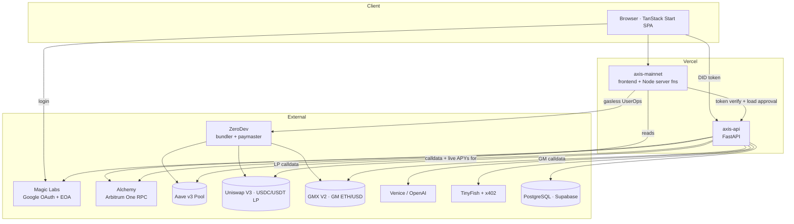
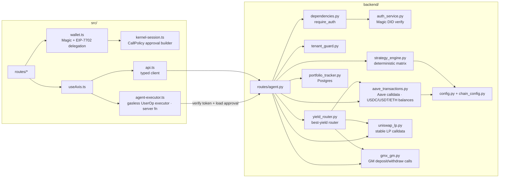
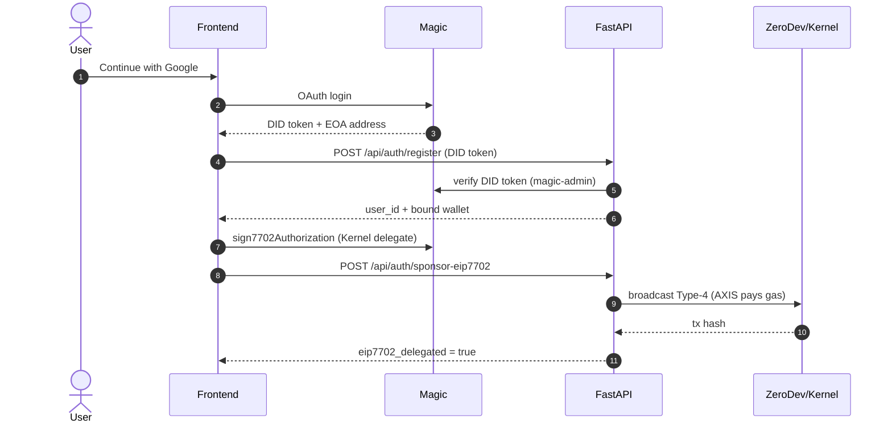
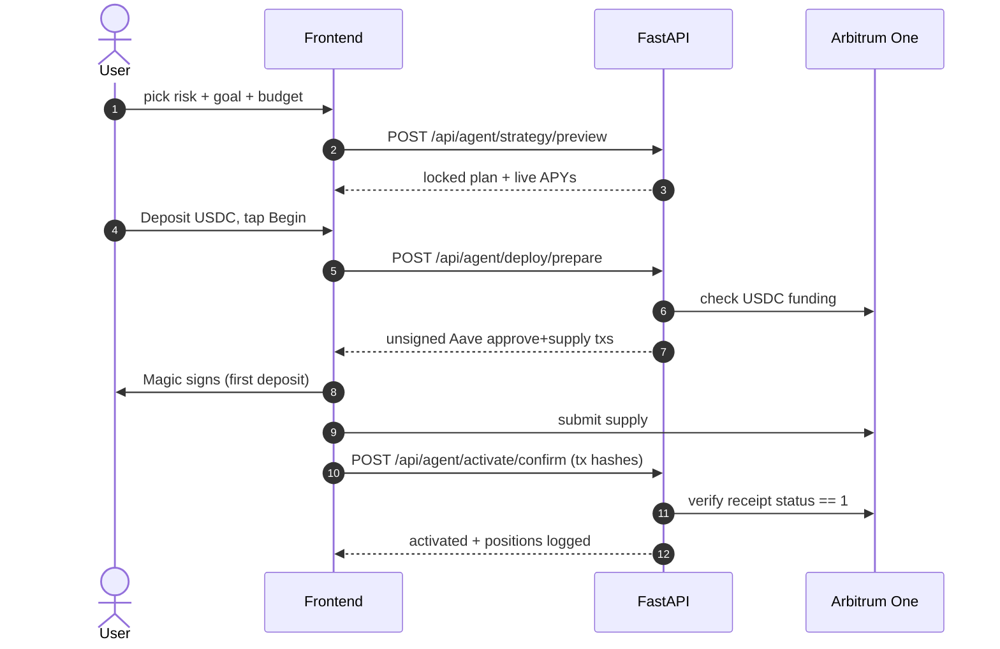
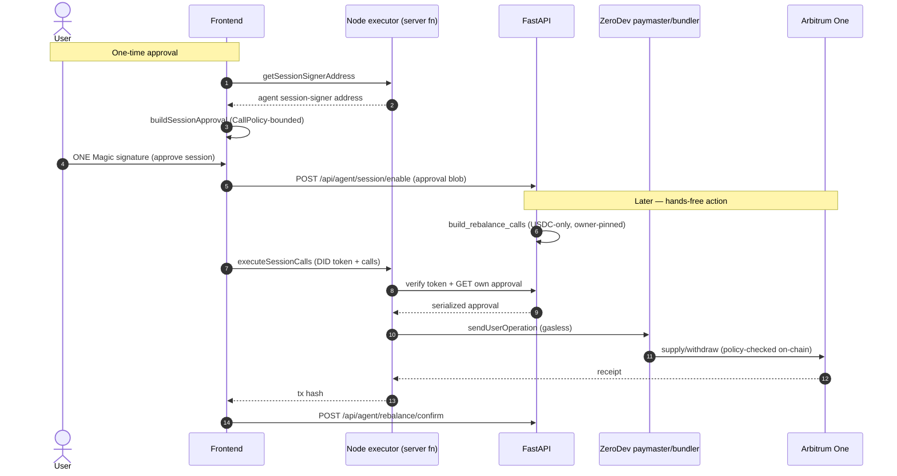
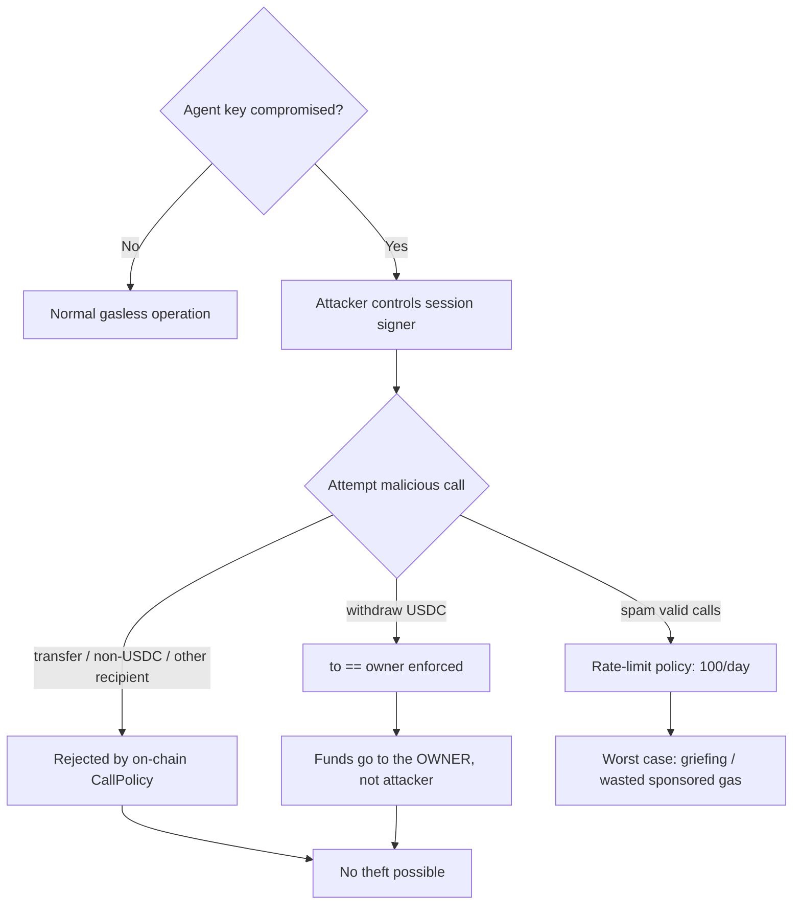
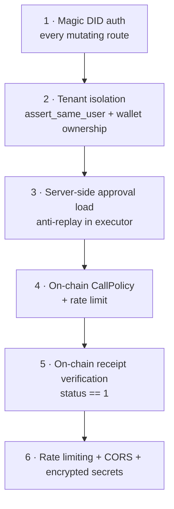
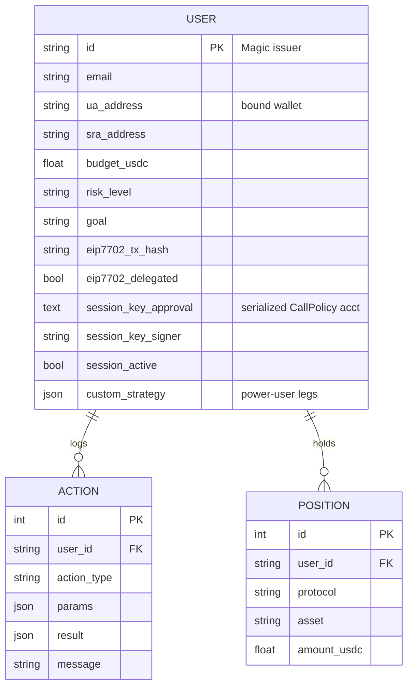

# AXIS — Architecture

> **Last updated:** 2026-07-19 · **Chain:** Arbitrum One (`42161`)
> Companion to the root [`README.md`](../README.md). This document is the system-design + security reference.

---

## 1. System context



**Two deploy targets, one repo:**
- `axis-mainnet` — the TanStack Start app. Its **Node server functions** (`createServerFn`) host the ZeroDev session executor and are the only place the agent key lives at runtime.
- `axis-api` — the FastAPI backend: auth, strategy engine, persistence, calldata building, yield data.

## 2. Component view



## 3. Onboarding & delegation



## 4. Deposit / activation (client-signed)



## 5. Hands-off mode (gasless session key)



## 5b. Best-yield router · one-tap apply (signing-free)

```mermaid
sequenceDiagram
  autonumber
  actor U as User
  participant FE as Frontend
  participant API as FastAPI
  participant RT as yield_router
  participant EX as Node executor
  participant ZD as ZeroDev paymaster
  participant CH as Arbitrum One

  U->>FE: open dashboard (Smart route)
  FE->>API: POST /agent/route/preview (exclude_venues?)
  API->>API: read balances (USDC/USDT/ETH) + GMX fundability
  API->>RT: route_best_yield(risk, goal, idle, market_ok, exclude)
  RT-->>API: RoutePlan (stable core + sleeve, folded)
  API-->>FE: plan + balances + gmx_fundable
  U->>FE: tap "Apply best route"
  FE->>API: POST /agent/route/apply/prepare
  API->>API: pre-skip GMX if no ETH; build per-venue calls
  API-->>FE: groups[] (aave / lp / gmx) + pre_skipped
  loop each venue group (Aave core first)
    FE->>EX: executeSessionCalls(group)
    EX->>ZD: gasless UserOp (policy-checked)
    ZD->>CH: supply / mint LP / GM deposit
    CH-->>EX: receipt (or leg fails -> graceful skip)
  end
  FE->>API: POST /agent/route/apply/confirm (executed legs)
  API->>CH: verify each receipt status == 1
  API-->>FE: "what AXIS did" summary (applied + skipped)
```

## 6. Session-key threat model



**Guarantee:** the signed `CallPolicy` (`src/lib/kernel-session.ts`) pins every allowed call to the owner. Base policy: `approve` spender = Aave Pool, `supply` asset = USDC & `onBehalfOf` = owner, `withdraw` asset = USDC & `to` = owner. Market-risk extensions (opt-in): Uniswap swap/mint **recipient = owner** (USDC/USDT only), and GMX `createDeposit`/`createWithdrawal` **receiver = owner** & **market = the vetted GM pool** pinned at fixed calldata offsets, with `sendWnt` value capped (~0.01 ETH). A compromised key can, at worst, move a user's own funds between their wallet and their own positions, or waste sponsored gas (bounded to 100 ops/day). **It can never redirect funds to a third party, on any venue.**

### Defense-in-depth layers



## 7. Data model (core)



## 8. Deployment topology

```mermaid
graph TD
  subgraph GitHub
    REPO[henrysammarfo/axis · main]
  end
  subgraph Vercel · teamtitanlink
    FE[axis-mainnet<br/>Production env: VITE_* + server keys]
    API[axis-api<br/>Production env: full key set · root=backend/]
  end
  REPO -.deployed via Vercel CLI.-> FE
  REPO -.deployed via Vercel CLI.-> API
  FE -->|VITE_API_URL / API_URL| API
  API -->|Alchemy dedicated| RPC[Arbitrum One]
  API -->|asyncpg| PG[(Supabase Postgres)]
  FE -->|ZeroDev chain/42161| PM[Bundler + Paymaster]
```

> **Deploy note:** production ships via `vercel deploy --prod` (actor `cursor-cli`) from each linked project, **not** auto-on-push. A `git push` to `main` alone does not create a new production deployment — run the CLI deploy for `axis-mainnet` (root) and `axis-api` (`backend/`).

| Concern | Current state | Production target |
|---|---|---|
| Database | **Postgres (Supabase) ✅ wired** (async SQLAlchemy + asyncpg) | Managed backups + migrations |
| Agent key storage | Vercel encrypted env | KMS/HSM; per-user signers |
| Paymaster limit | ZeroDev dashboard policy | Explicit project spend cap |
| CORS | `axis*.vercel.app` regex + explicit origins | Exact production origins only |
| Config status | RPC key **redacted** ✅ | — |

## 9. Design principles

1. **Non-custodial by construction** — keys derive from the user's Google login; AXIS never holds user funds.
2. **On-chain enforcement over trust** — the session `CallPolicy` is the security boundary, not backend code.
3. **Deterministic strategy, AI narration** — allocations come from a fixed matrix and a deterministic best-yield router (live APYs in, fixed rules out); AI only explains.
4. **Real transactions only** — every user-visible action maps to a verifiable Arbiscan tx; simulated hashes are rejected.
5. **Fail fast** — the backend refuses to boot without its full key set.
